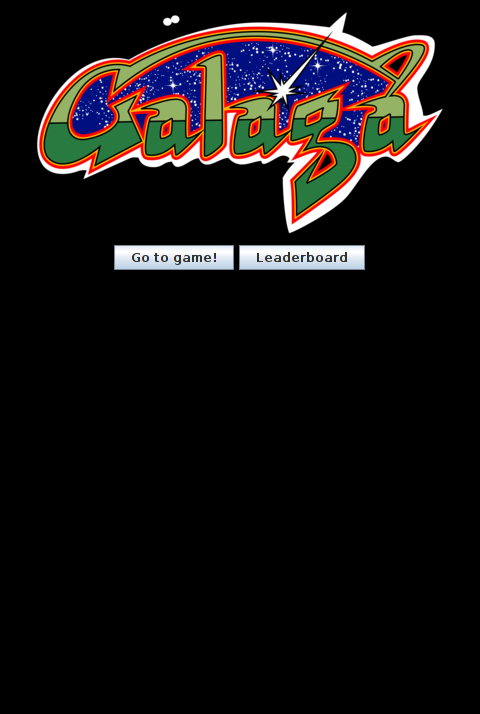
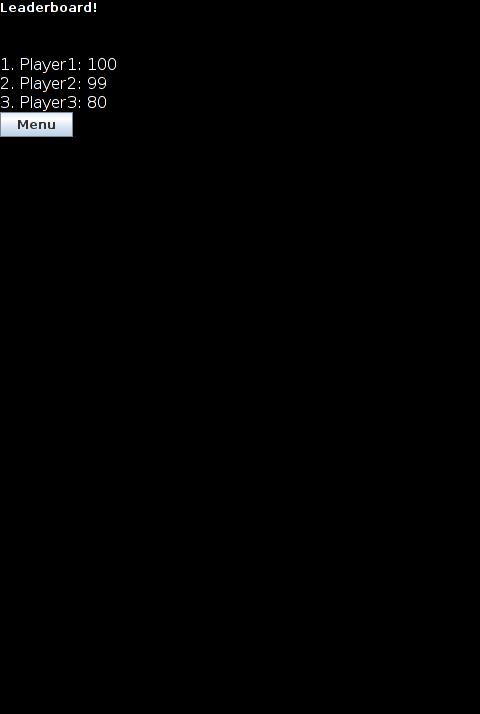

# Testing the leader board

Go to the `data/leaderboard.txt` file. In it, put the following entries

Player1,100  
Player2,99  
Player3,80

# Now if you run the game

You should see the following screen

Press the 'Leaderboard' button and you should see the following

Make sure to check that the scores are in highest order, there is a leaderboard button and

Press the 'Menu' button to get back to the menu screen and you should see

